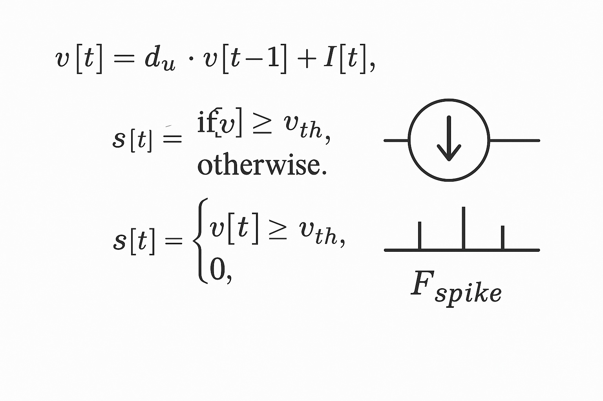
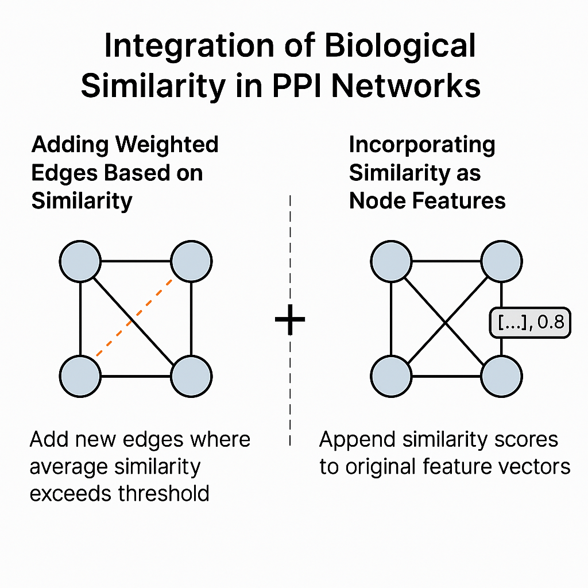
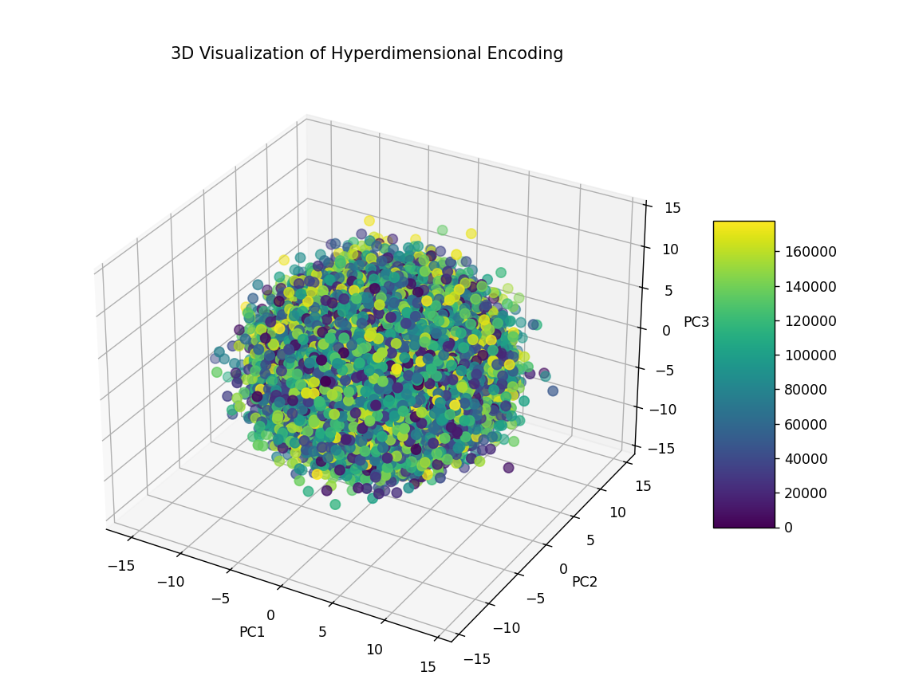

# 🧠 Alzheimer’s Protein–Protein Interaction Prediction

**[📄 View Preprint on bioRxiv](https://www.biorxiv.org/content/10.1101/2025.04.11.647919v1)** 
** [Doi](https://doi.org/10.1101/2025.04.11.647919)
**📝 Title:** _Graph-Based Modeling of Alzheimer's Protein Interactions via Spiking Neural, Hyperdimensional Encoding, and Scalable Ray-Based Learning_  
**👤 Author:** Saba Zare

This project introduces a scalable and biologically inspired framework to predict missing or novel protein–protein interactions (PPIs) related to **Alzheimer’s disease**. It integrates graph modeling, hyperdimensional encoding, spiking neural networks (SNNs), and evolutionary feature selection for accurate and efficient link prediction.

---

## 🔬 Overview

- **Graph Construction**
  - Built from curated PPI databases (e.g., BioGRID, UniProt, KEGG).
  - Enriched using sequence, structural, and functional similarity.
  - Similarity scores are encoded as weighted edges or node attributes.

- **Feature Selection**
  - A graph-aware **Genetic Algorithm (via DEAP)** filters biologically relevant features.
  - Reduces dimensionality and enhances GNN performance.

- **Embedding & Learning**
  - Proteins are embedded using:
    - **Hyperdimensional Computing (HDC)**
    - **Spiking Neural Networks (LIF neurons)**
    - **Graph Neural Networks (GNNs)**

- **Link Prediction**
  - Combines:
    - **LAVA** (cosine similarity metric)
    - **Annoy** (Approximate Nearest Neighbors)
  - Enables scalable and threshold-tuned PPI inference.

- **Distributed Computing**
  - Powered by **Ray** for parallel embedding generation, prediction, and evaluation.

---

## 📁 Project Structure

| File | Description |
|------|-------------|
| `alzhimerintel1.py` | Main execution script |
| `GNN.py` | Graph Neural Network implementation |
| `HDC.py` | Hyperdimensional encoding module |
| `lif.py` | Leaky Integrate-and-Fire SNN simulation |
| `fusion_link_prediction.py` | Hybrid link prediction logic |
| `evaluate.py` | Evaluation metrics and graph analytics |
| `similarity.py` | Computation of biological similarities |

---

## 🧬 Datasets Used

| Dataset | Description | Link |
|--------|-------------|------|
| **BioGRID Alzheimer’s Project** | Curated PPIs for Alzheimer's disease | [Download](https://downloads.thebiogrid.org/File/BioGRID/Release-Archive/BIOGRID-4.4.244/BIOGRID-PROJECT-alzheimers_disease_project-4.4.244.zip) |
| **UniProtKB/Swiss-Prot** | Annotated protein database | [Visit](https://www.uniprot.org/uniprotkb) |
| **KEGG Pathway hsa05010** | Alzheimer’s disease pathway | [Visit](https://www.kegg.jp/entry/hsa05010) |
| **RCSB PDB** | Protein 3D structural data | [Visit](https://www.rcsb.org/docs/general-help/organization-of-3d-structures-in-the-protein-data-bank) |

---
## 📊 Model Architecture & Visual Representations

Below are visual illustrations of the model's components and key computational structures used in the project:

   
  <em>Fig 1. Architecture of the Spiking Neural Network (SNN).</em>

   
  <em>Fig 2. Structure of nodes and edges in the biological interaction graph.</em>

   
  <em>Fig 3. 3D visualization of Hyperdimensional Computing representation.</em>

## ⚙️ Requirements

- Python 3.8+
- PyTorch
- NetworkX
- Scikit-learn
- DEAP
- Ray
- Annoy
- NumPy, Pandas, Matplotlib

## 🔍 Approximate Nearest Neighbor Search with Annoy

To efficiently perform similarity search among high-dimensional vectors (e.g., EEG features, HDC representations, or PPI embeddings), we use **Annoy (Approximate Nearest Neighbors Oh Yeah)**.

Annoy is a fast, memory-efficient library developed by Spotify for **approximate nearest neighbor search** in large datasets. It constructs a forest of random projection trees to partition the space and provides fast querying with a trade-off between accuracy and speed.

### 🔧 Key Features:
- Optimized for high-dimensional data
- Very fast at querying neighbors
- Suitable for large-scale problems (millions of vectors)
- Works well in both RAM and disk-based settings

### 🧠 Usage in this project:
We use Annoy to:
- Find similar brain signal representations
- Link related protein interaction patterns
- Speed up retrieval during training and evaluation phases

For more details, visit the [Annoy GitHub repository](https://github.com/spotify/annoy).

  ## 📣 Citation
  If you use this work, please cite the preprint:
@article{zare2025alzheimers,
  author = {Saba Zare},
  title = {Graph-Based Modeling of Alzheimer's Protein Interactions via Spiking Neural, Hyperdimensional Encoding, and Scalable Ray-Based Learning},
  journal = {bioRxiv},
  year = {2025},
  doi = {10.1101/2025.04.11.647919}

}
## 📄 License

This project is shared under the **Creative Commons Attribution 4.0 International License (CC BY 4.0)**.  
You are free to share and adapt the material for any purpose, even commercially, **as long as proper credit is given to the original author.**
